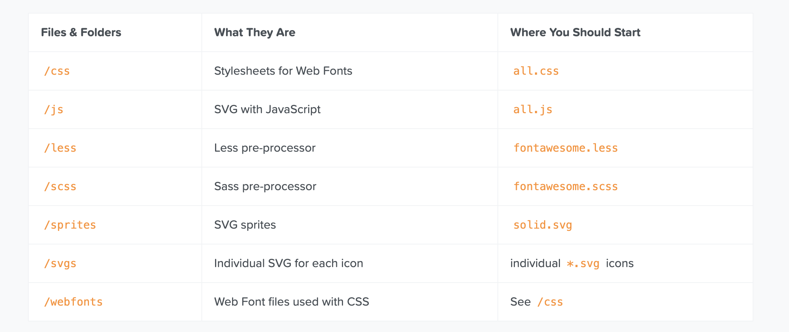

## fontawesome 使用

如何将fontawesome下载下来整合在项目中使用。

##### 1. 首先下载所有代码
[下载地址](https://fontawesome.com/v5.15/how-to-use/on-the-web/setup/hosting-font-awesome-yourself)


<details style="margin-left:20px;color:#495057;">
  <summary>点我展开看文件详情</summary>
  <pre><code>
fontawesome-free-5.15.3-web
├─ LICENSE.txt
├─ attribution.js
├─ css
│  ├─ all.css
│  ├─ all.min.css
│  ├─ brands.css
│  ├─ brands.min.css
│  ├─ fontawesome.css
│  ├─ fontawesome.min.css
│  ├─ regular.css
│  ├─ regular.min.css
│  ├─ solid.css
│  ├─ solid.min.css
│  ├─ svg-with-js.css
│  ├─ svg-with-js.min.css
│  ├─ v4-shims.css
│  └─ v4-shims.min.css
├─ js
│  ├─ all.js
│  ├─ all.min.js
│  ├─ brands.js
│  ├─ brands.min.js
│  ├─ conflict-detection.js
│  ├─ conflict-detection.min.js
│  ├─ fontawesome.js
│  ├─ fontawesome.min.js
│  ├─ regular.js
│  ├─ regular.min.js
│  ├─ solid.js
│  ├─ solid.min.js
│  ├─ v4-shims.js
│  └─ v4-shims.min.js
├─ less
│  ├─ _animated.less
│  ├─ _bordered-pulled.less
│  ├─ _core.less
│  ├─ _fixed-width.less
│  ├─ _icons.less
│  ├─ _larger.less
│  ├─ _list.less
│  ├─ _mixins.less
│  ├─ _rotated-flipped.less
│  ├─ _screen-reader.less
│  ├─ _shims.less
│  ├─ _stacked.less
│  ├─ _variables.less
│  ├─ brands.less
│  ├─ fontawesome.less
│  ├─ regular.less
│  ├─ solid.less
│  └─ v4-shims.less
├─ metadata
│  ├─ categories.yml
│  ├─ icons.json
│  ├─ icons.yml
│  ├─ shims.json
│  ├─ shims.yml
│  └─ sponsors.yml
├─ scss
│  ├─ _animated.scss
│  ├─ _bordered-pulled.scss
│  ├─ _core.scss
│  ├─ _fixed-width.scss
│  ├─ _icons.scss
│  ├─ _larger.scss
│  ├─ _list.scss
│  ├─ _mixins.scss
│  ├─ _rotated-flipped.scss
│  ├─ _screen-reader.scss
│  ├─ _shims.scss
│  ├─ _stacked.scss
│  ├─ _variables.scss
│  ├─ brands.scss
│  ├─ fontawesome.scss
│  ├─ regular.scss
│  ├─ solid.scss
│  └─ v4-shims.scss
├─ sprites
│  ├─ brands.svg
│  ├─ regular.svg
│  └─ solid.svg
├─ svgs
│  ├─ .DS_Store
│  ├─ brands
│  │  ├─ 500px.svg
│  │  ├─ accessible-icon.svg
│  │  ├─ accusoft.svg
|  |  └─...
│  └─ solid
│     ├─ ad.svg
│     ├─ address-book.svg
│     └─ ...
└─ webfonts
   ├─ fa-brands-400.eot
   ├─ fa-brands-400.svg
   ├─ fa-brands-400.ttf
   ├─ fa-brands-400.woff
   ├─ fa-brands-400.woff2
   ├─ fa-regular-400.eot
   ├─ fa-regular-400.svg
   ├─ fa-regular-400.ttf
   ├─ fa-regular-400.woff
   ├─ fa-regular-400.woff2
   ├─ fa-solid-900.eot
   ├─ fa-solid-900.svg
   ├─ fa-solid-900.ttf
   ├─ fa-solid-900.woff
   └─ fa-solid-900.woff2
  </code></pre>
</details>

##### 2. 使用方式
- 全量使用
  all.js 中包含四种类型的图标，因而在使用中覆盖的图标类型比较全面。
  使用时引入 `all.js`, 然后将 `webfonts` 整个目录拷贝在项目中。
  ```html
  <head>
   <link href="/your-path-to-fontawesome/css/all.css" rel="stylesheet"> <!--load all styles -->
   </head>
   <body>
   <i class="fas fa-user"></i> <!-- uses solid style -->
   <i class="far fa-user"></i> <!-- uses regular style -->
   <i class="fal fa-user"></i> <!-- uses light style -->
   <!--brand icon-->
   <i class="fab fa-github-square"></i> <!-- uses brands style -->
   </body>
  ```
- 使用某一种类型
  如果是只想使用到 solid, regular, light, brand 中的一种。
  需要引入 `fontawesome.css` 以及待使用类型的 css，比如 `brands.css`，然后将 `webfonts` 中对应的字体文件拷贝进项目即可。
  ```html
   <head>
      <!-- Our project just needs Font Awesome Solid + Brands -->
      <link href="/your-path-to-fontawesome/css/fontawesome.css" rel="stylesheet">
      <link href="/your-path-to-fontawesome/css/brands.css" rel="stylesheet">
      <link href="/your-path-to-fontawesome/css/solid.css" rel="stylesheet">
   </head>
   <body>
      <i class="fas fa-user"></i> <!-- uses solid style -->
      <i class="fab fa-github-square"></i> <!-- uses brand style -->
   </body>
  ```

- 使用svg图标
   需要 `all.js`，以及相关的 svg 文件
   ```html
   <head>
      <script defer src="/your-path-to-fontawesome/js/all.js"></script> <!--load all styles -->
   </head>
   <body>
      <i class="fas fa-user"></i> <!-- uses solid style -->
      <i class="far fa-user"></i> <!-- uses regular style -->
      <i class="fal fa-user"></i> <!-- uses light style -->
      <!--brand icon-->
      <i class="fab fa-github-square"></i> <!-- uses brands style -->
   </body>
   ```

##### 3. 查看图标编号，以及根据类型等进行筛选
[图标查询](https://fontawesome.com/v5.15/icons?d=gallery&p=2&q=book&s=solid)

